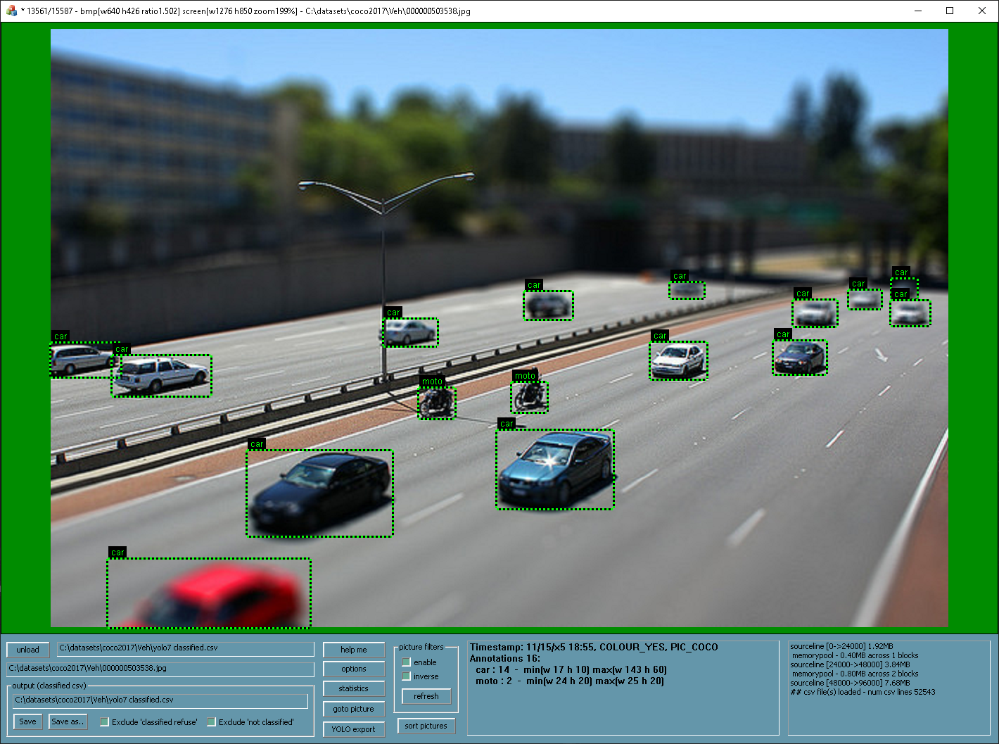
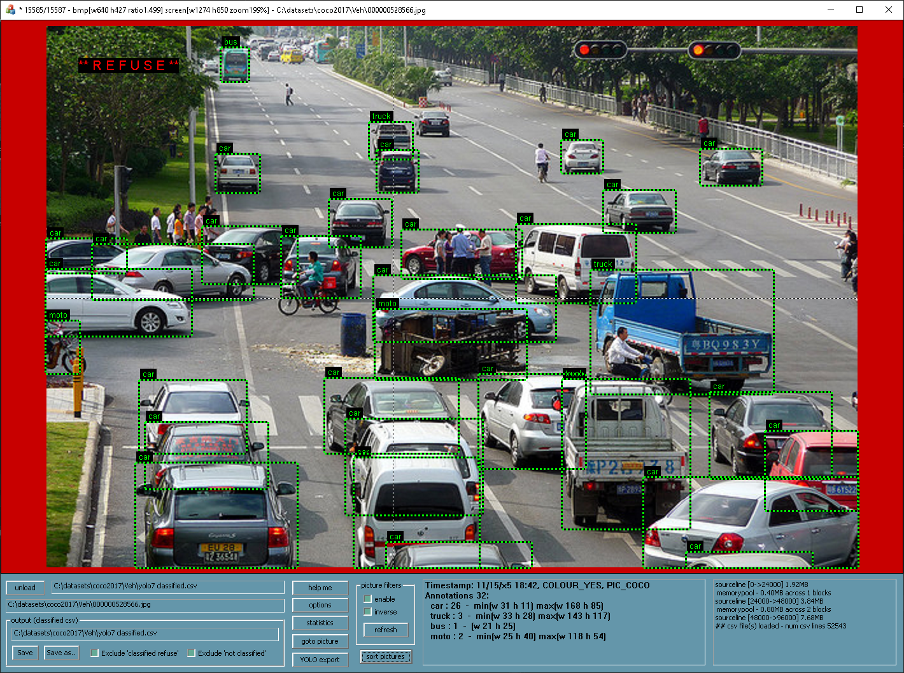
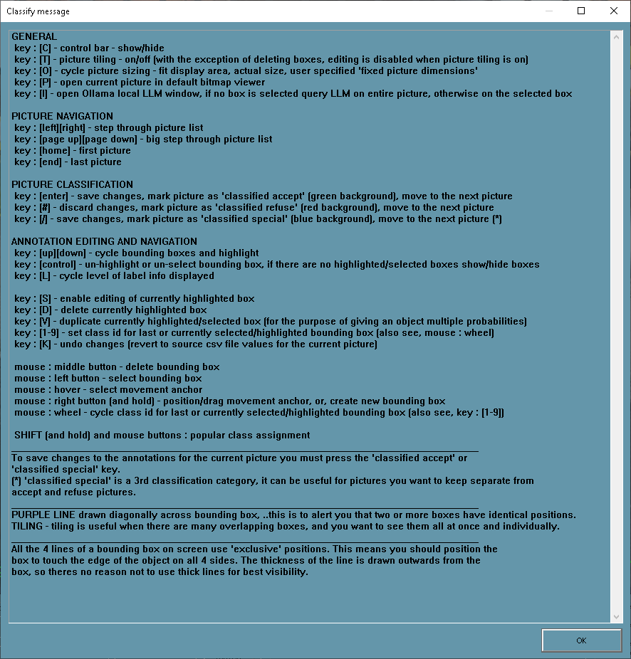
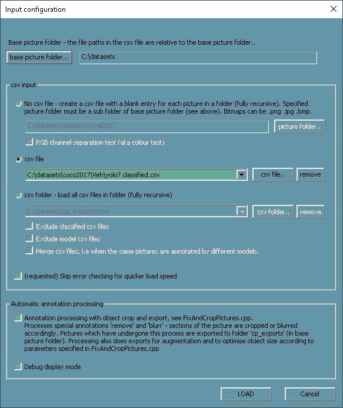
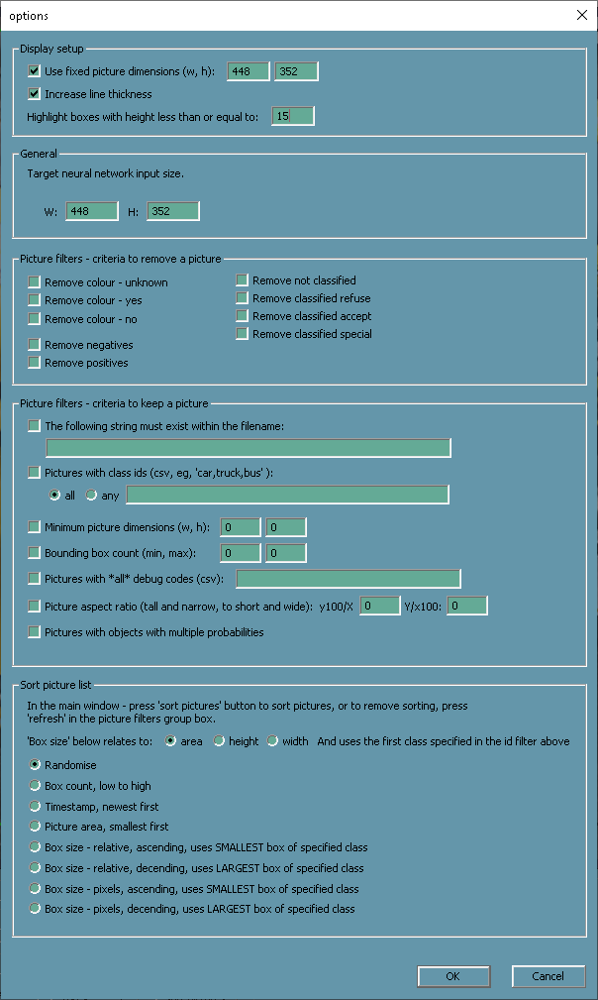
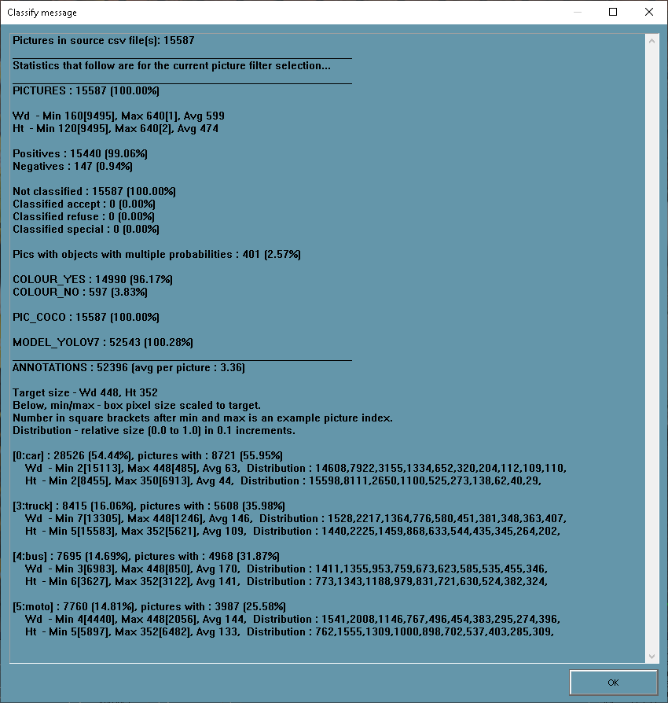
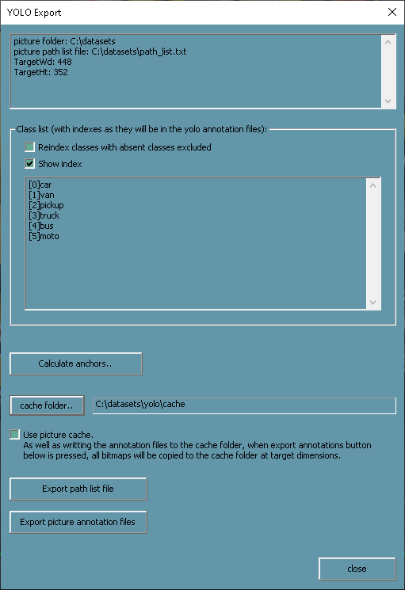
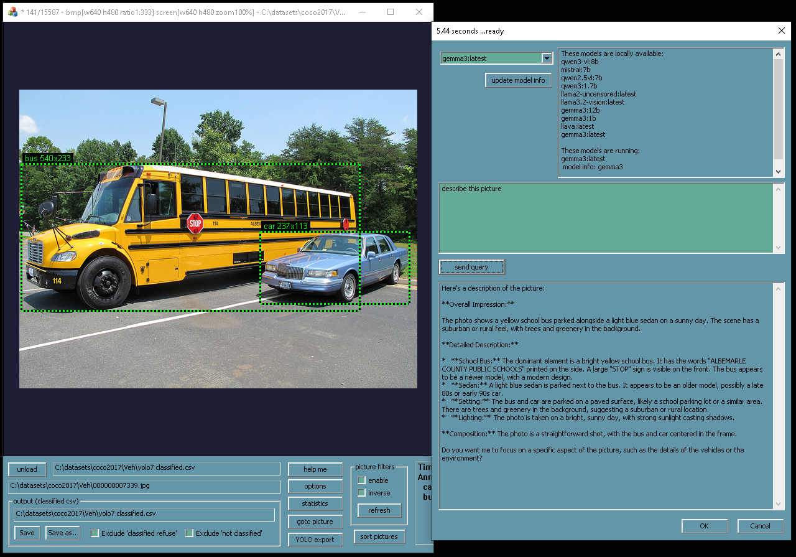

# Classify - YOLO Annotation and Classification Tool for Windows

* Open source Windows tool for semi-automatic YOLO/object-detection dataset preparation.
* Use a pre-trained object detection model to annotate your dataset, then review each image and annotations and classify as 'accept' or 'refuse'.
* Also includes ability to edit/mark bounding boxes in images by hand.
* Store project data in a single .csv file. 
* Export YOLO path list and YOLO format annotation files.

## Usage options

### Semi automatic method - Use a pre-trained object detection model to generate an annotations .csv file

It is your job to generate the model annotations .csv file, this program does not run object detection models, and that is the beauty of it because it keeps this program simple.
The .csv file must contain one annotation per line in the following format.. 
#### filename_count*,picture_code*,colour_code*,width,height,filename,box_x1,box_y1,box_x2,box_y2,class,confidence*,model_code*
Fields marked * are optional. 'filename' should be in "quotes" and is relative to a 'base picture folder' specified in the UI. 
Example, I have used mscoco-trained YOLOv7 to annotate vehicles in my images, here are the first 3 lines of my .csv file: 
1,0,1,640,480,"coco2017\Veh\000001.jpg",0.008536,0.245823,0.717354,0.625195,car,85,2 
1,0,1,640,480,"coco2017\Veh\000001.jpg",0.419244,0.002830,0.998441,0.463768,truck,99,2 
2,0,1,480,640,"coco2017\Veh\000064.jpg",0.109182,0.554797,0.367805,0.647733,bus,90,2 

### Manual method - You don't have a pre-trained model and wish to mark all annotations by hand

In the 'Input Config' dialog select the option to generate a .csv file of blank entries for the specified picture folder.

## Other features

* Options for filtering and sorting the pictures and annotations.
* Dataset statistics.
* Calculate YOLO anchors.
* Export all pictures at YOLO target dimensions to a cache folder to eliminate repetitive image resizing during training.
* Use Ollama to run LLMs locally, query an LLM on the current picture (see screenshot). Currently just a toy and not used for anything, but with further development this could be useful to help automate classification.

## Installation and Setup

* Download the repo, open classify.sln in Visual Studio, build and run. That's it, simple.
* There is currently no UI for adding classes, this must be done by editing the code. Add your desired classes to function AddDetectionClasses() in Useful.cpp. Currently it includes classes for vehicle detection.
* Optional - install https://ollama.com/ if you want to play with the LLM window.

## Specialised feature

Annotations 'remove' and 'blurr' - used to crop out unwanted sections of the picture and blur sections of the picture respectively.
CSV files with these annotations must be processed by the code in FixAndCropPictures.cpp. The modified pictures are exported to a separate folder.
This feature was written for my specific purpose, it is unlikely to be useful to you unless you adapt the code for your purpose.

## Screenshots

Picture accepted - green background.

Picture refused - red background.

Controls list (press the 'help me' button).

Input options, load a single .csv or a folder of .csv files. Plus advanced options.

Options for filtering and sorting pictures and annotations.

Simple but comprehensive dataset statistics.

Yolo export options.

Ollama LLM window.

